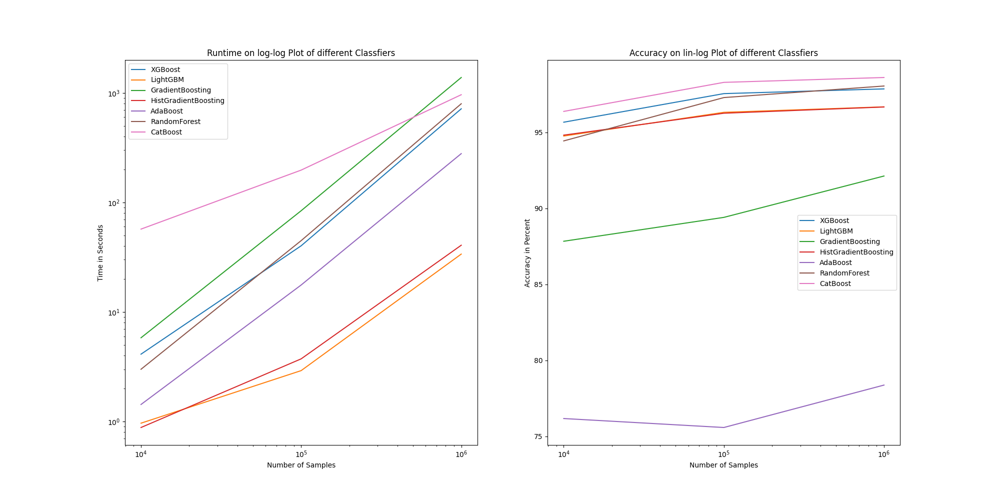

# classification_examples

This is a little project to visualize results of different Classification algorithms.

The data was created with the help of the sklearn make_classification function.

7 different algorithms were used:

* XGBoost
* LightGBM
* GradientBoosting
* HistGradientBoosting
* AdaBoost
* RandomForest
* CatBoost

Note that the LightGBM Classifier and the HistGradientBoosting are based on the same underlying algorithm hence the results are very similiar.

